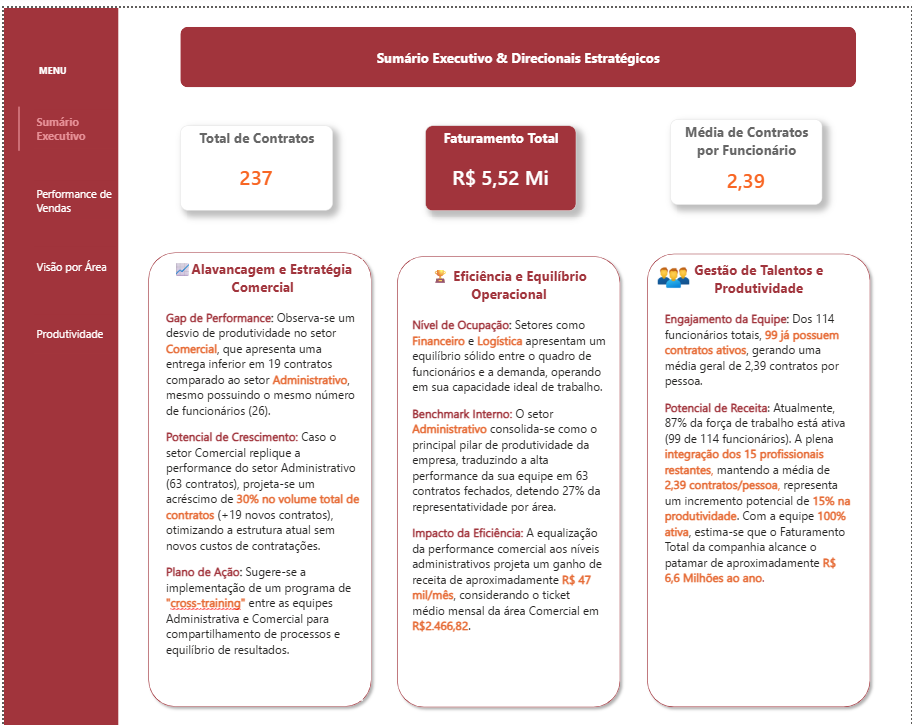
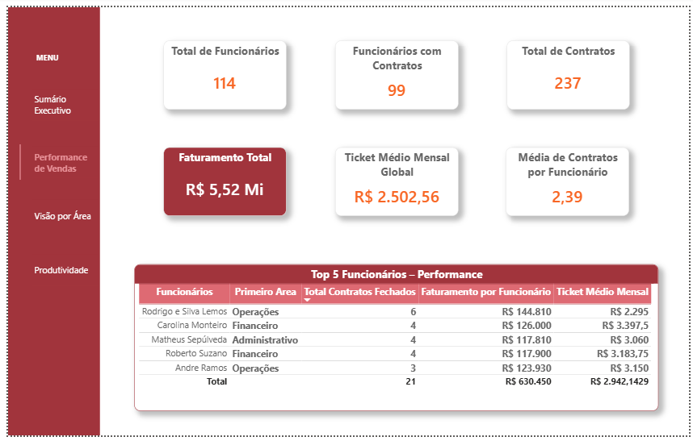
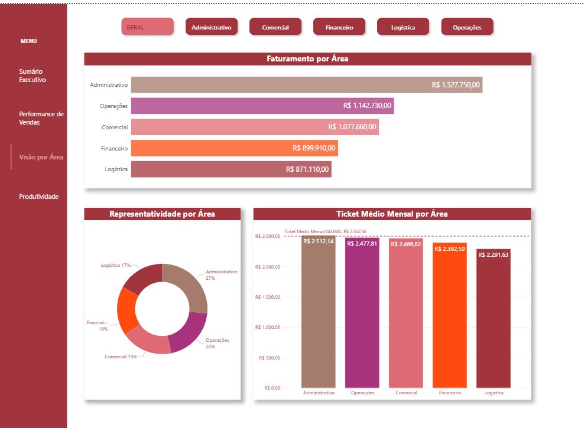
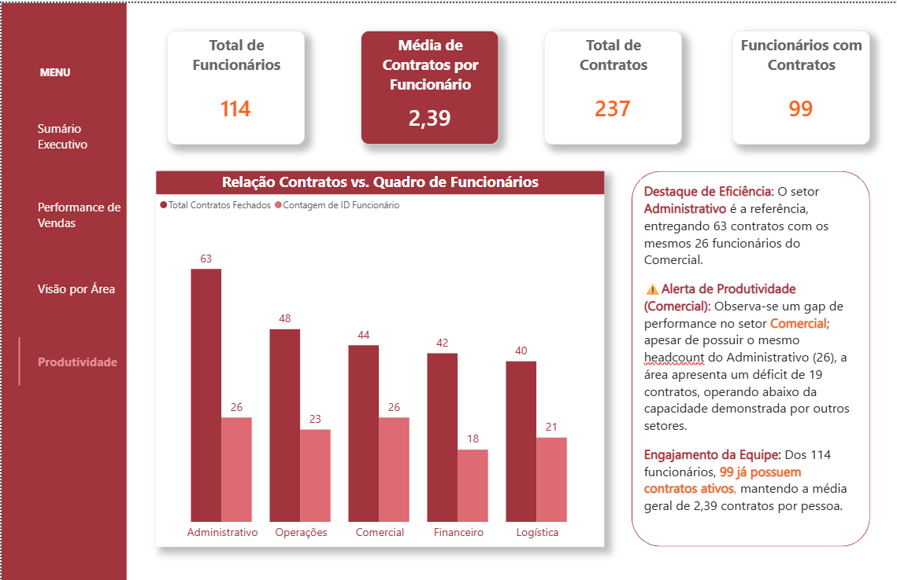

# Análise de Faturamento e Desempenho Operacional de uma Empresa

### 📋 Sobre o Projeto
Este projeto realiza uma **análise end-to-end** por envolver o ciclo completo de análise de dados, desde a extração inicial até a entrega da solução final. O desenvolvimento unificou o poder de processamento do Python com a excelência visual do Power BI. Toda a estrutura foi desenhada seguindo os princípios de UX Design e a lógica da Pirâmide Invertida de modo que o Sumário Executivo atue como o ponto de partida estratégico e o detalhamento técnico e operacional surja na sequência.

### 🏗️ Metodologia e Governança de Dados

Um grande diferencial deste projeto foi a etapa de conciliação para garantir a segurança das informações antes da construção dos visuais.

* **Integridade das Bases** O faturamento total de R$ 5,52 Mi foi validado por meio de uma checagem cruzada entre Python e Power BI de modo que a concordância dos valores comprova a ausência de erros no cruzamento das fontes e a aplicação correta das regras de negócio.

* **💡 Estratégia de Validação** O desenvolvimento adotou uma dupla checagem analítica utilizando tanto o Python para realizar o mapeamento inicial e extrair as primeiras conclusões e métricas do negócio quanto o Power Query dentro do Power BI, replicando essa mesma lógica de cálculo e estruturação para assegurar a consistência dos dados e o perfeito funcionamento dos filtros do dashboard.

* **Escalabilidade e Flexibilidade** A junção das tabelas brutas foi estruturada em Python por meio da função `.merge(how='left')` que confere flexibilidade na conexão das bases e do `.groupby().size()` que garante a escalabilidade do modelo permitindo mapear e agrupar a totalidade dos registros sem o risco de perda de informações antes da carga final no relatório.

### 📈 Visualização do Dashboard

#### 1. Sumário Executivo & Direcionais Estratégicos
A página inicial do relatório apresenta os principais indicadores de desempenho e funciona como o painel de tomada de decisão da diretoria, revelando, sobretudo, dois grandes direcionadores estratégicos para o crescimento da empresa.

* **Estratégia de Eficiência Comercial** A identificação do desvio de produtividade entre as equipes levou à proposta de um programa de *cross-training* entre as áreas Administrativa e Comercial permitindo o compartilhamento de processos para alavancar em 30% o volume de contratos sem gerar novos custos de contratação.

* **Insight Estratégico** A análise identificou que a integração total dos 15 profissionais restantes tem o potencial de elevar a receita anual da empresa de R$ 5,52 Milhões para aproximadamente R$ 6,6 Milhões representando um incremento de 15% na produtividade geral.

#### 2. Performance de Vendas
Esta visão detalha os indicadores globais de faturamento e identifica os Top Performers da organização para nortear as estratégias de treinamento.

* **Benchmark de Talento** O mapeamento identificou o colaborador do setor de Operações na liderança dos Top Performers com 6 contratos fechados, o que estabelece um referencial interno de alta performance para servir de modelo ao programa de *cross-training*.

* **Indicador de Eficiência** O monitoramento fixou o Ticket Médio Mensal Global em R$ 2.502,56 servindo como métrica de controle para avaliar a rentabilidade dos novos contratos assinados em cada setor.

#### 3. Visão por Área & Produtividade
Estas visões apresentam gráficos comparativos de Ticket Médio por setor e correlacionam o volume de contratos com o quadro total de funcionários.

* **Nota Técnica** No Power BI, optou-se pela utilização da escala decimal com a média de 2,39 contratos por funcionário para simplificar a leitura executiva e garantir a rápida compreensão do nível de produtividade por indivíduo de forma direta e sem ruídos visuais.

### 🛠️ Tecnologias e Origem dos Dados

* **Fontes de Dados** Integração de múltiplos datasets em formatos `.csv` para as bases de Funcionários e Clientes e `.xlsx` para a base de Serviços Prestados.

* **Python (Pandas & Matplotlib)** Execução de todo o processo de ETL com o tratamento de tipos de dados distintos e análise visual exploratória para a validação das hipóteses de negócio.

* **Power BI** Construção da modelagem relacional de dados, criação de medidas calculadas em DAX e desenvolvimento do design dos dashboards interativos.

> **Obs** A aba Laboratório foi mantida como uma página oculta no arquivo `.pbix` para fins de validação técnica e futuras expansões de métricas.

## ⚠️ Disclaimer

Declaro que todos os dados utilizados neste projeto de Análise de Faturamento e Desempenho Operacional são constituídos por informações **simuladas e fictícias** criadas exclusivamente para fins acadêmicos com o objetivo de demonstrar habilidades técnicas em Python, Pandas e Business Intelligence.

Estes registros **não representam informações reais, sigilosas ou confidenciais** de nenhuma organização de modo que as conclusões e recomendações geradas são baseadas unicamente neste conjunto de dados hipotéticos.

